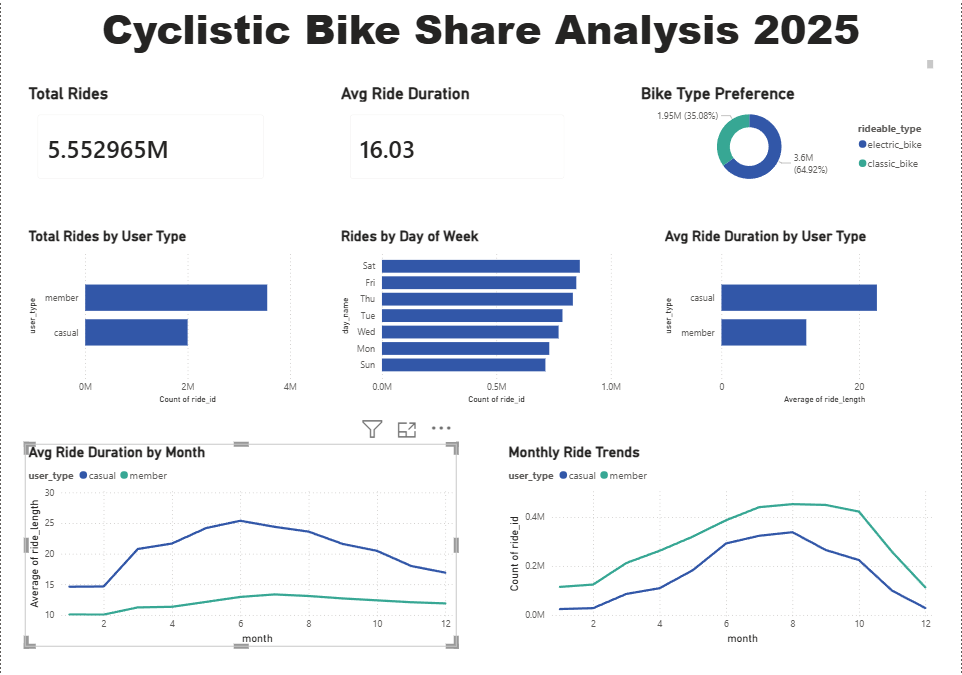

# 🚴 Cyclistic Bike Share Analysis 2025

## 📌 Project Overview
Analysis of 5.5 million Cyclistic bike share rides to identify behavioral differences between casual riders and annual members, with the goal of designing marketing strategies to convert casual riders into members.

## 🛠️ Tools Used
- **Microsoft Excel** — Initial data exploration
- **Power Query** — Data cleaning & transformation
- **Power BI** — Dashboard & visualization

## 📊 Dataset
- **Source:** Cyclistic/Divvy bike share public data
- **Period:** January 2025 – December 2025
- **Size:** 5.5 million rows across 12 monthly CSV files
- **Columns:** ride_id, rideable_type, started_at, ended_at, member_casual, and more

## 🔍 Business Question
**How do annual members and casual riders use Cyclistic bikes differently?**

## 🧹 Data Cleaning Process
- Combined 12 monthly CSV files using Power Query
- Removed null values from critical columns
- Created calculated columns:
  - `ride_length` — Duration of each ride in minutes
  - `month` — Extracted from started_at
  - `day_of_week` — Extracted from started_at
  - `day_name` — Mon to Sun labels
- Removed negative and zero ride lengths
- Final dataset: ~5.5M clean rows

## 📈 Key Findings
1. **Members take more rides** — ~3.5M vs ~2M casual rides
2. **Casual riders ride longer** — avg ~25 mins vs members ~13 mins
3. **Weekends are busiest for casual riders** — Saturday highest
4. **Summer peak** — Both groups peak June–August
5. **Classic bikes preferred** — 64.92% classic vs 35.08% electric

## 💡 Recommendations
1. Target casual riders with **weekend membership promotions**
2. Launch **summer conversion campaigns** (May–July)
3. Highlight **cost savings** of annual membership
4. Use **digital media** targeting leisure and tourism audiences
5. Offer **trial memberships** during peak summer months

## 📊 Dashboard


## 📁 Project Structure
```
cyclistic-analysis/
│
├── README.md
└── dashboard.png
```
